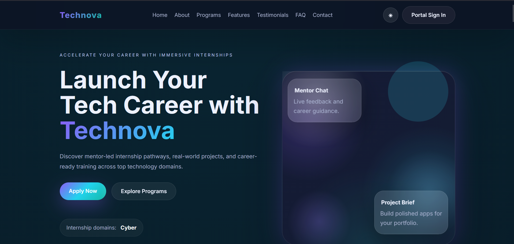
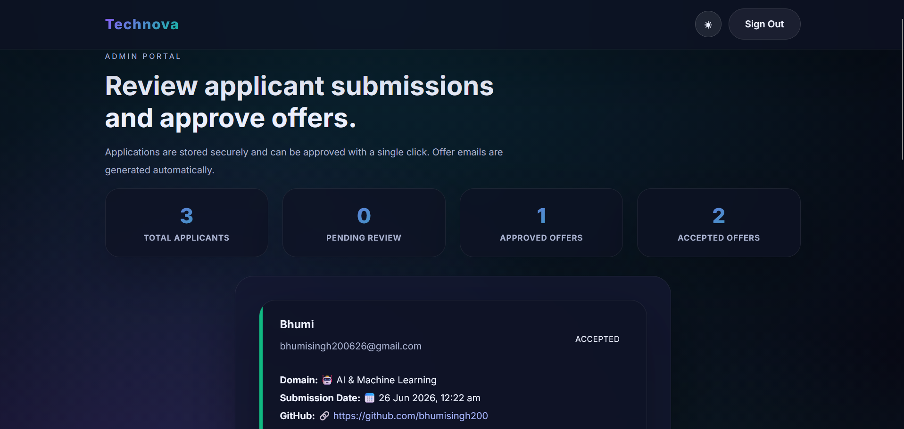

# 🚀 TechNova Internship Portal

<div align="center">

### A Modern Full-Stack Internship Management Platform

A premium internship portal where students can apply for internships, track their application status, and receive offer letters, while administrators can review applications, manage candidates, and automate onboarding.

**HTML • CSS • JavaScript • Node.js • MySQL**

</div>

---

# 📖 Overview

TechNova Internship Portal is a full-stack web application that simulates a real-world internship recruitment system.

Applicants can explore internship programs, submit applications with their professional profiles and resume, track their application progress, and access onboarding resources. Administrators can securely review applications, approve candidates, manage internship workflows, and generate offer letters.

---

# ✨ Features

## 👨‍🎓 Student Portal

* Responsive Landing Page
* Internship Program Showcase
* Student Login
* Internship Application Form
* GitHub, LinkedIn & LeetCode Profile Submission
* Resume Upload (PDF)
* Application Status Tracking
* Student Dashboard
* Download Offer Letter
* Accept Internship Offer
* Newsletter Subscription
* Contact Form

---

## 🏢 Admin Portal

* Secure Admin Login
* View All Applications
* Download Applicant Resumes
* Review GitHub / LinkedIn / LeetCode Profiles
* Approve Applications
* Generate Offer Letters
* Send Offer Letter via Email
* Track Candidate Status

---

## 🎨 UI Features

* Responsive Design
* Glassmorphism UI
* Dark / Light Theme
* Typing Animation
* Animated Statistics
* Scroll Reveal Animations
* FAQ Accordion
* Testimonials Carousel
* Sticky Navigation
* Mobile Hamburger Menu
* Smooth Scrolling
* Back-to-Top Button

---

# 🛠 Tech Stack

### Frontend

* HTML5
* CSS3
* JavaScript (ES6)

### Backend

* Node.js
* Native HTTP Module
* File System (FS)
* SMTP Mail Service

### Database

* MySQL

### Authentication

* HTTP-Only Cookie Sessions

---

# 📂 Project Structure

```text
TechNova_ResponsiveLandingPage/
│
├── index.html
├── styles.css
├── script.js
├── server.js
├── db.js
├── mail.js
├── uploads/
├── sent_emails/
└── README.md
```

---

# 🚀 Getting Started

## Prerequisites

* Node.js (v14+)
* MySQL Server

## Installation

```bash
git clone <repository-url>

cd TechNova_ResponsiveLandingPage

npm install

node server.js
```

Open:

```text
http://localhost:3000
```

---

# ⚙ Environment Variables

Create a `.env` file:

```env
PORT=3000

SESSION_SECRET=your_secret_key

ADMIN_EMAIL=admin@example.com
ADMIN_PASSWORD=your_password

DB_HOST=localhost
DB_USER=root
DB_PASS=your_database_password
DB_NAME=technova_db

SMTP_HOST=your_host
SMTP_PORT=587
SMTP_USER=your_email
SMTP_PASS=your_password
```

---

# 🗄 Database

Create:

* applications
* newsletter_subscribers

Import the SQL schema included in the project.

---

# 🔄 Application Workflow

```text
Student
     │
     ▼
Apply for Internship
     │
Upload Resume
     │
Pending Review
     │
───────────────
Admin Reviews
───────────────
     │
Approve
     │
Offer Letter Generated
     │
Student Accepts Offer
```

---

# 📸 Screenshots

Create a folder named:

```text
screenshots/
```

Include these images:

| Screenshot          | File Name              |
| ------------------- | ---------------------- |
| Homepage            | homepage.png           |
| Internship Programs | internship-domains.png |
| Learning Journey    | learning-journey.png   |
| Student Login       | student-login.png      |
| Application Form    | application-form.png   |
| Student Dashboard   | student-dashboard.png  |
| Admin Dashboard     | admin-dashboard.png    |
| Candidate Approval  | candidate-approval.png |
| Offer Letter        | offer-letter.png       |
| Email Preview       | email-preview.png      |
| Dark Mode           | dark-mode.png          |
| Mobile View         | mobile-view.png        |

Example:

```md
## Homepage



## Student Dashboard


## Admin Dashboard


```

---

# 🚀 Future Improvements

* AI Resume Screening
* Interview Scheduling
* Certificate Generation
* Multi-Admin Support
* Analytics Dashboard
* AI Candidate Ranking

---

# 👩‍💻 Author

**Bhumi Singh**

B.Tech CSE (AI)

Aspiring Software Engineer | Java Developer | Full Stack Developer

---

⭐ If you found this project useful, consider giving it a star.

